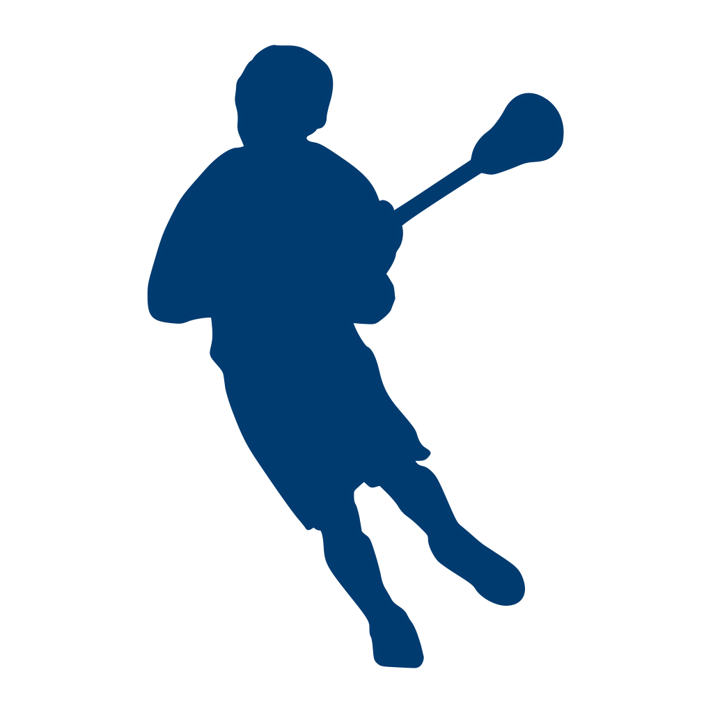
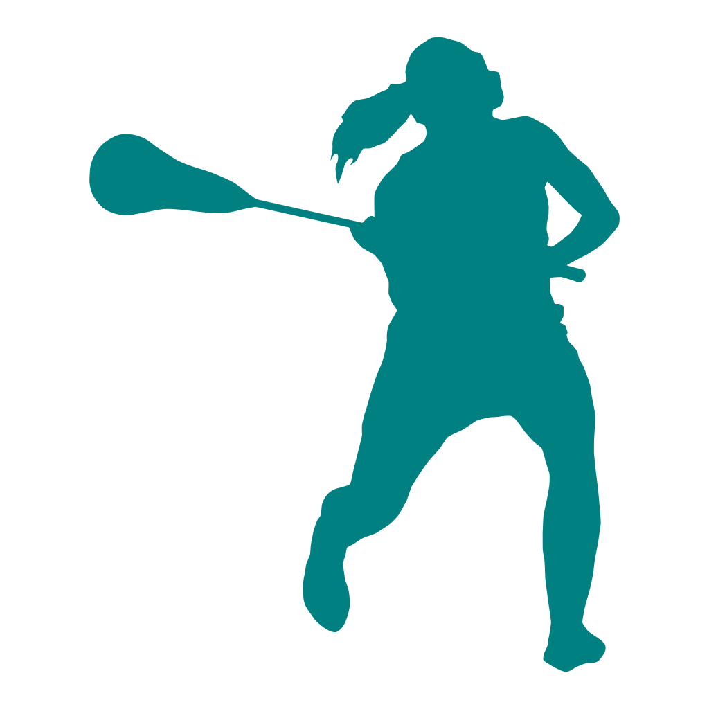

# Lacrosse Stats
### One repo, 2 apps

## Men's Lacrosse Stats

Your lacrosse stats clipboard, in an App! 

--- 

My first lacrosse stats app was Lacrosse Scorebook. That was a full-fledged scorebook app run on an iPad that allowed you to keep track of entire teams, seasons, games and all the stats associated with any given game. It was a bit much. After trying to rebuild it from the ground up (*big mistake!*) I created this app as a "lite" version to focus just on keeping track of stats for a single team for a single game. 

The first version also had a 1-year non-recurring in-app subscription that enabled the export of the stats via email in a PDF summary report, a CSV file for importing into a spreadsheet and a MaxPreps-formatted file for upload to the MaxPreps site. I chose MaxPreps because that was the site used by the lacrosse club my son played for. 

I eventually pulled the app from the app store because I was no longer supporting it and it seemed wrong to keep charging people for an app that wasn't going to be updated. 

Now, I'm back to iOS development and I'm getting these two apps back up and running. No in-app purchases this time, just a free stats-keeping app for men's lacrosse. Enjoy! 

**Version:** 2.0

**Language:** Objective-C

**Layout:** Storyboards

**Known issues:** None

**Planned features:**
* I think MaxPreps added new stats fields that we can upload. So I need to update the MaxPreps export feature to include those new stats.  
* I want to start converting this to Swift and SwiftUI. This will be an opportunity for me to learn more about that process. Should be fun. 
* In the move to SwiftUI, I'll probably update the UI in general to look a bit more up-to-date. I'll admit, it looks kinda, meh. 

## Women's Lacrosse Stats

Your lacrosse stats clipboard in an app designed specifically for women's lacrosse! 

--- 

After I got the above-mentioned stats app in the app store, plenty of people wanted to know if I had a women's version. Turns out no one was making one! So I listened to my customers and decided to build a version specifically for women's lacrosse - they're stats are a bit different from the men's. In the process, I realized the basic functionality of the two apps was the same so I could just create two build targets, one for men's and one for women's and allow them to share the code that was the same and have gender-specific code where necessary. It works pretty well. 

I'll be updating this build simultaneously with the men's version as I move to Swift and SwiftUI. 

**Version:** 2.0

**Language:** Objective-C

**Layout:** Storyboards

**Known issues:** None

**Planned features:**
* I think MaxPreps added new stats fields that we can upload. So I need to update the MaxPreps export feature to include those new stats.  
* I want to start converting this to Swift and SwiftUI. This will be an opportunity for me to learn more about that process. Should be fun. 
* In the move to SwiftUI, I'll probably update the UI in general to look a bit more up-to-date. I'll admit, it looks kinda, meh. 
